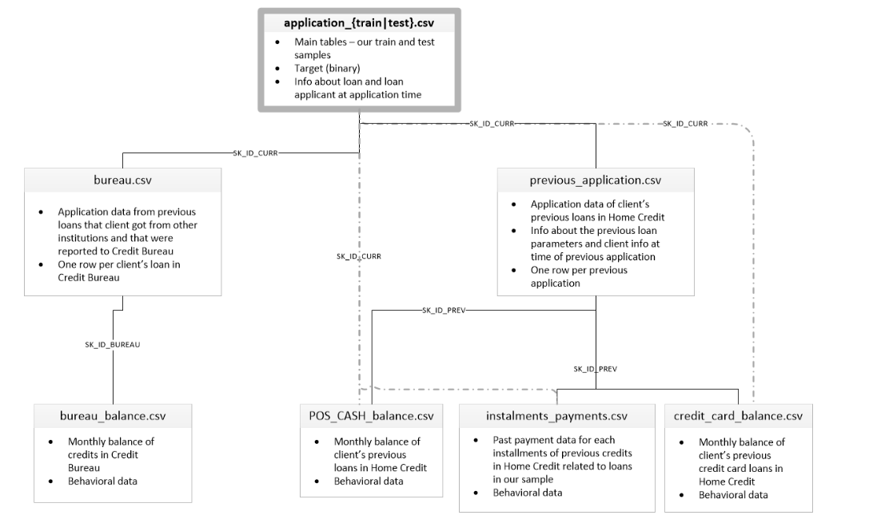
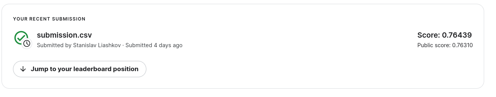

# Home Credit Default Risk - Credit Scoring Model

## Overview
This repository contains a machine learning model developed for the Home Credit Default Risk competition on Kaggle. The challenge involves predicting the repayment abilities of applicants seeking loans.
This problem is crucial as it aims to help those with insufficient or non-existent credit histories to obtain loans fairly. This repo consists of 4 jupyter-notebooks that correspond to following steps:
- **EDA**
- **Grouping and merging tables**
- **Preprocessing**
- **Model training and selection**

**Schema of data**

- **tables**
  - **application_train/application_test**: 
    Main training and testing data with information about each loan application at Home Credit.
    Every loan has its own row and is identified by the feature SK_ID_CURR.
    The training application data comes with the TARGET indicating 0 (loan was repaid) or 1 (loan was not repaid).

  - **bureau**: 
    Data concerning client's previous credits from other financial institutions.
     Each previous credit has its own row in bureau, but one loan in the application data can have multiple previous credits.

  - **bureau_balance**: 
      Monthly data about the previous credits in bureau.
      Each row is one month of a previous credit, and a single previous credit can have multiple rows.

  - **previous_application**: 
      Previous applications for loans at Home Credit of clients who have loans in the application data.
      Each current loan in the application data can have multiple previous loans.
      Each previous application has one row and is identified by the feature SK_ID_PREV.

  - **POS_CASH_BALANCE**: 
      Monthly data about previous point of sale or cash loans clients have had with Home Credit.
      Each row is one month of a previous point of sale or cash loan, and a single previous loan can have many rows.

  - **credit_card_balance**: 
      Monthly data about previous credit cards clients have had with Home Credit.
      Each row is one month of a credit card balance, and a single credit card can have many rows.

  - **installments_payments**: 
     Payment history for previous loans at Home Credit.
    There is one row for every made payment and one row for every missed payment.

## Data Source
The dataset is from the Home Credit Default Risk competition hosted by Kaggle, with the challenge of using alternative data, including telco and transactional information, to predict clients' repayment abilities. For more details, visit the [competition page](https://kaggle.com/competitions/home-credit-default-risk).
## Objective
Predict the probability of each applicant's repayment ability. (metric for competition - *AUC*)

## Final result

 
